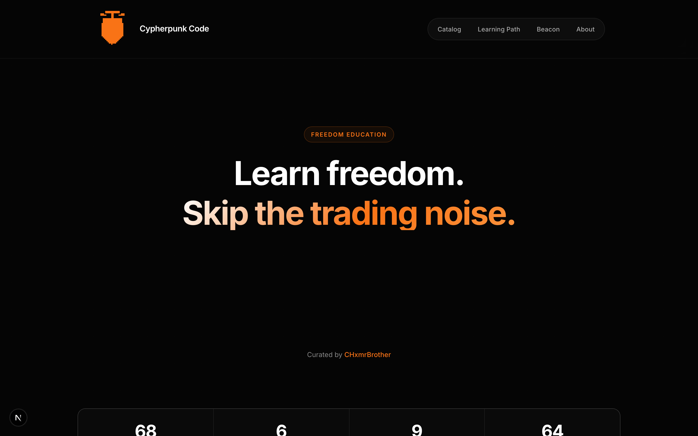
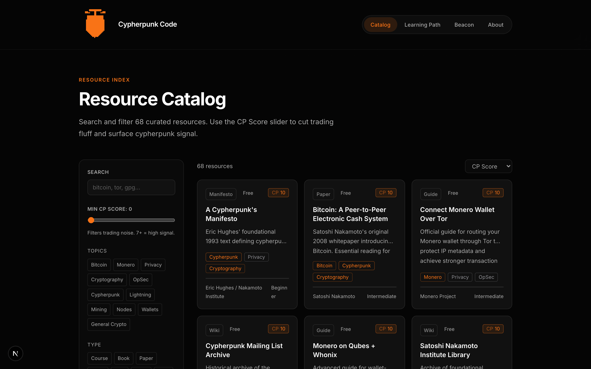
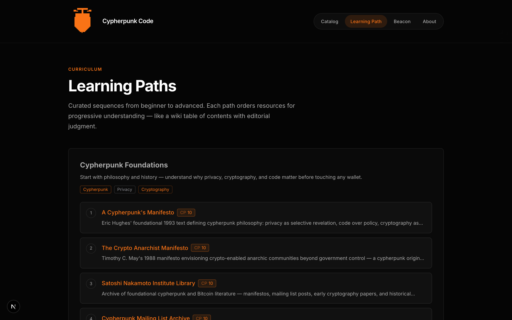

<div align="center">


# Cypherpunk Code

Freedom education for Bitcoin, Monero, and cypherpunk sovereignty.

**Learn freedom. Skip the trading noise.**

[](LICENSE)
[](https://github.com/9lordisgod/cypherpunk-code)

Curated by [@CHxmrBrother](https://x.com/CHxmrBrother)

</div>

> **Archive notice:** The original hosted site at [cypherpunk-code.com](https://www.cypherpunk-code.com) has been retired. This repository is the canonical public source. Fork it, self-host it, and run your own freedom education index.

## What this is

A Next.js freedom education index — 68 curated resources, 6 learning paths, multilingual UI, and editorial Cypherpunk Scores. No trading noise, just signal.

## Demo

UI screenshots from the original platform are in [`demo/screenshots/`](demo/screenshots/README.md):

| Homepage | Catalog | Learning paths |
| --- | --- | --- |
|  |  |  |

## Quick start

```bash
git clone https://github.com/9lordisgod/cypherpunk-code.git
cd cypherpunk-code
npm install
cp .env.example .env.local
npm run db:push
npm run dev
```

Open [http://localhost:3000](http://localhost:3000).

### Production deploy

Set your public URL before building:

```bash
NEXT_PUBLIC_SITE_URL=https://your-domain.example npm run build
```

Edit `src/data/site.json` for creator handle, contact, and optional donation addresses.

## Fork & extend

See **[docs/FORK_GUIDE.md](docs/FORK_GUIDE.md)** for:

- How to fork and deploy your own instance
- Phase-by-phase roadmap with copy-paste AI prompts
- Wiki.js Codex implementation game plan
- Reference files: `docs/roadmap/forward-steps.md` and `docs/roadmap/wiki-codex-gameplan.md`

## Project structure

| Path | Purpose |
| --- | --- |
| `src/data/resources.json` | Curated resource catalog |
| `src/data/paths.json` | Learning path sequences |
| `src/data/site.json` | Site metadata (name, handles, donations) |
| `docs/` | Mission, roadmap, FAQ, contributor docs |
| `demo/screenshots/` | UI/UX reference images |

## Scripts

```bash
npm run dev          # Local development
npm run build        # Production build (includes docs)
npm run docs:dev     # Preview documentation at :4000
npm run audit:catalog # Check catalog URLs
npm run test         # Run tests
```

## Contributing

Pull requests welcome. Read [docs/CONTRIBUTING.md](docs/CONTRIBUTING.md) and [SECURITY.md](SECURITY.md).

Questions or shout-outs: [@CHxmrBrother](https://x.com/CHxmrBrother) on X.

## License

[GNU Affero General Public License v3.0](LICENSE) — copyleft applies to network-deployed modified versions.